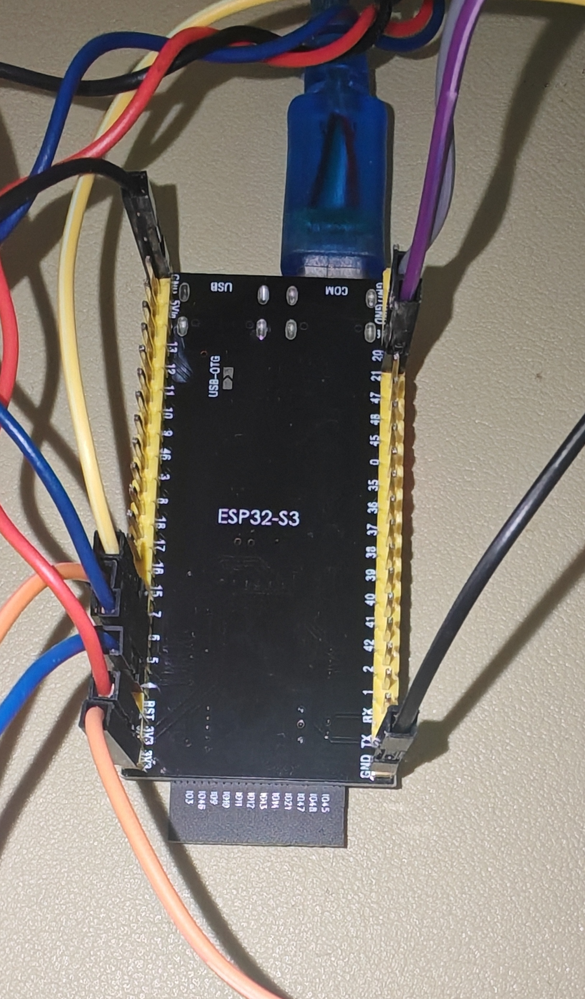

# ESP32 + ThingsBoard IoT 智能环境监测系统

##  功能简介
- 实时上传温湿度、光照数据至 ThingsBoard
- 支持远程RPC控制：
  - 蜂鸣器开关
  - 风扇开关
  - 水泵开关（继电器）
  - RGB灯模式切换（白、红、绿、蓝、关）
- 按键计数上传

##  项目目录结构
<pre>```
ESP32_ThingsBoard_IoT/
├── images/
│ ├── wiring_1.png
│ └── wiring_2.png
│
├── src/
│ └── main.ino
│
├── videos/
│ └── demo.mp4
│
├── .gitignore
└── README.md  </pre>

## 硬件清单
- ESP32-S3
- DHT11 温湿度传感器
- BH1750 光照强度传感器
- WS2812 RGB灯珠
- 蜂鸣器、风扇、继电器、按键

##  接线表
| 模块     | ESP32 引脚 |
|:----------|:-----------|
| DHT11     | GPIO7      |
| BH1750 SDA| GPIO21     |
| BH1750 SCL| GPIO20     |
| 蜂鸣器    | GPIO4      |
| 风扇      | GPIO5      |
| 继电器    | GPIO6      |
| RGB灯     | GPIO48     |
| 按键      | GPIO0      |

##  软件库依赖
- PubSubClient
- DHT sensor library
- BH1750
- FastLED
- Adafruit NeoPixel
- Adafruit Unified Sensor

##  使用方法
1. 修改 `main/main.ino` 中的 WiFi 和 token 配置
2. 使用 Arduino IDE 上传至 ESP32
3. 打开 ThingsBoard 仪表盘，绑定设备查看数据、执行RPC指令

## 📸 接线示意图

### 📷 接线图 1



### 📷 接线图 2


##  演示视频
[演示视频](videos\demo.mp4")